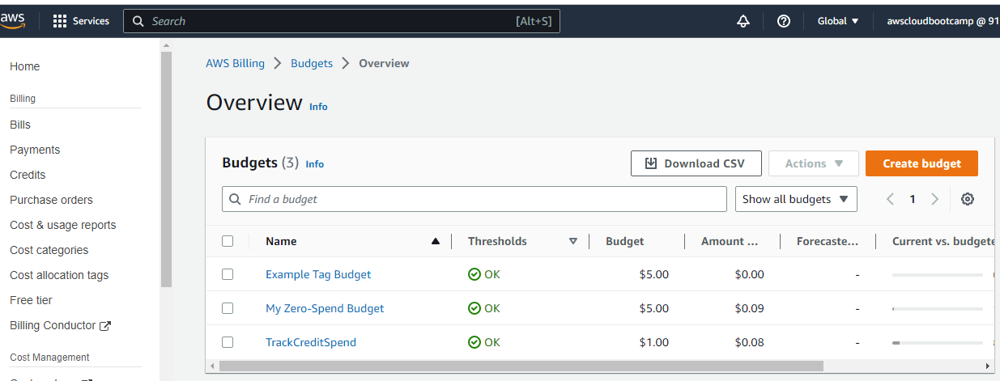
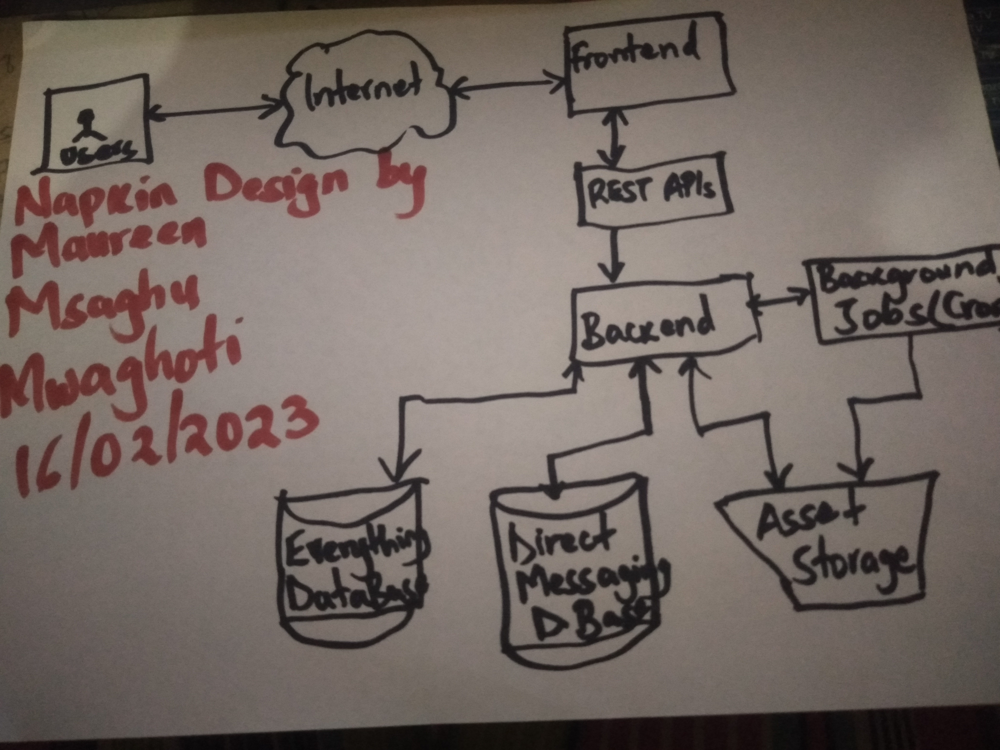
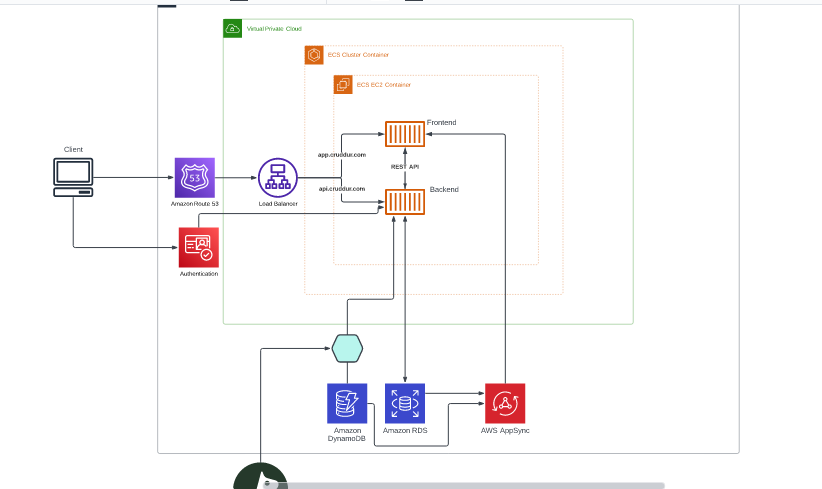

# Week 0 — Billing and Architecture

Quite a hectic week, I had so much fun updating my requirements for week 1:
As the prerequisites for the bootcamp, I had created a new account that would be separate from my previous AWS account. 

## Homework Challenges
### Step 1:Enforcing Security using Organizations
- Created an Organization with my root AWS account as the management account. I then created an IAM User and created a passoword for the IAM user and then I downloaded the name and password(I might decide to use a password manager later on ) as a csv file onto my  local machine and enforced security for the root account using MFA from the Google Authenticator App installed on my phone.
- To enable mutliple permissions for the account, I applied the Administrator permissions on the IAM user.

### Step 2:Enabling Credentials for my IAM User
- Logged into my account as the IAM User created in Step 1. When we log in for the first time as the IAM , AWS will prompt us to reset our password (this is an option that we select/tick when creating the IAM user).
- To create credentials for the IAM user, I had to log out then log back in as root user In the IAM console, I was able to create the IAM credentials for my IAM user that I will use to configure the AWS CLI which i then downloaded as a CSV file.
- I also secured the account using MFA from the Google Authenticator App installed on my phone.
##### IMPORTANT: Be sure to maintain only 2 access keys at any given time.

### Step 3:Installing and configuring the AWS CLI
- Used CloudShell  and Installed the AWS CLI for my IAM accounton Gitpod.
- Then set up the credentials for my github account and committed the changed to Github.
- Used the CLI to create an AWS budget.
##### IMPORTANT: Be sure to remove the ACCESS KEYS and SECRET ACCESS KEYS from the code before pushing to Github.

### Step 4:Spending and Budgets
- Created 2 Budgets, one that would monitor my spend for my AWS free credits and another that would track Dollar spend in the free tier. I created both budgets by CLI and the console.

- I also created a Billing Alarm both through the Console and CLI that will be triggered once 50%, 75%, 80%, 100% spend threshold has been neared and or exceeded.

##### IMPORTANT: Be sure to maintain only 2 budgets so as to remain within the free tier.

### Step 5: The Logical diagram and Napkin design Architectures.
- Followed the Github Markdown tutorials to upload a photo of my napkin design.

- 
- 
[This is the link from Lucid Chart app for the Logical digram]
(https://lucid.app/lucidchart/be53d504-319e-46ba-8e0e-aa52b36eaa6c/edit?viewport_loc=-1156%2C180%2C3330%2C1461%2C0_0&invitationId=inv_8e890b65-1684-4a45-9551-5239c148d0fb)

#### Resources used 
1. [Well Architected Labs](https://wellarchitectedlabs.com/security/100_labs/100_aws_account_and_root_user/) 
2. [Free AWS Cloud Bootcamp - Week 0 Part 1](https://dev.to/msaghu/free-aws-bootcamp-week-1-part-1-ada)
3. [Free AWS Cloud Bootcamp - Week 0 Part 2](https://dev.to/msaghu/free-aws-bootcamp-week-0-part-2-5fi6)
4. [Well Architected Labs - Cost Optimization](https://wellarchitectedlabs.com/cost/100_labs/100_1_aws_account_setup/)
5. [ExampPro Billing Video](https://www.youtube.com/watch?v=OdUnNuKylHg&list=PLBfufR7vyJJ7k25byhRXJldB5AiwgNnWv&index=14)
6. [AWS CLI documentation](https://docs.aws.amazon.com/cli/latest/reference/)
7. [How to create Github Markdown files - Exampro](https://www.youtube.com/watch?v=mWaSBRJhUFM&list=PLBfufR7vyJJ7k25byhRXJldB5AiwgNnWv&index=19)
